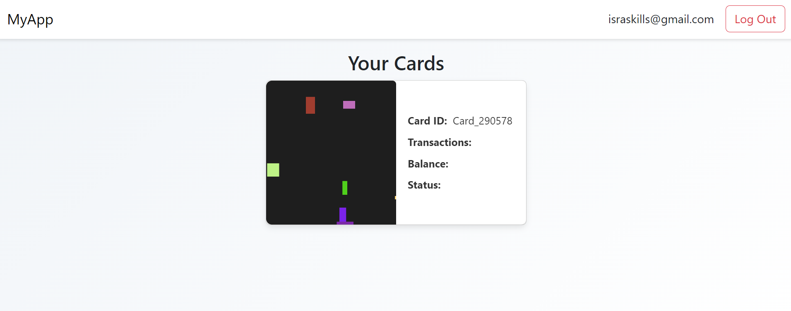
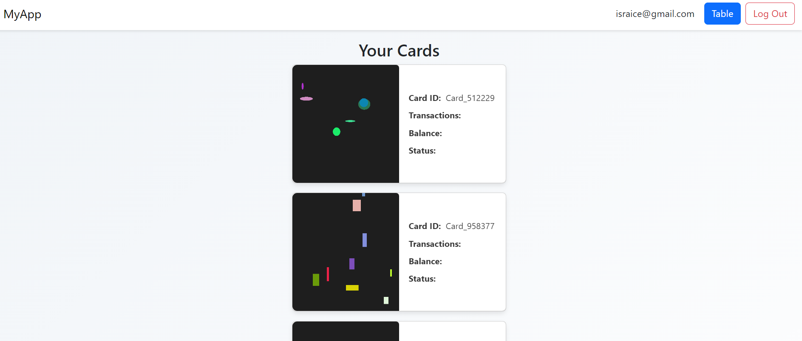
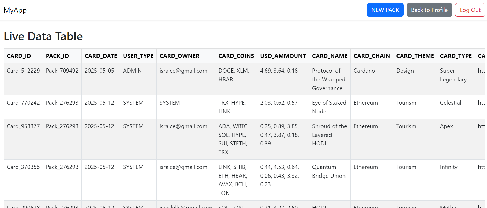

# NAKAMA - Card Game
- https://github.com/israice/flask-cards.git
- collect cards with crypto suprise box

Main login page

Add owner to card

USER profile page

ADMIN profile page

ADMIN page

  
DEV Log

### v001
- start date 2025.05.01
- create flask with 2 html pages and google auth
- upload to github
### v002
- translate all code comments to english 
- SSE strwam data/auth_users.csv to templates\table.html
- adding Navbar with buttons
- allow table button only to admins from system_admin.csv 
### v003
- move all csv files to /data/ and update paths
- added AA_compaire_csv_files.py
- added AB_create_5_new_card_ids.py
- added AC_create_1_new_pack_id.py
- added A_run.py and 3 files as list
### v004
- add user to system_db next to pack
- create list of scripts for A_run_create_packs.py
- create list of scripts for B_run_send_packs_to_store.py
- create list of scripts for C_run_card_ownership.py
### v005
- create /core/ and fix paths for all files
### v006
- move all paths to .env and fix project paths
- redesighn login.html
### v007
- create add_card_owner.html
### v008
- create csv with CARD_AUTH keys
- change all existing sripts paths to .env
- create .env_EXAMPLE
### v009
- create AE_add_domain_to_system_card_url.py
- add /card/ to url inside core\data\system_card_auth.csv
- add card_id to core\data\system_card_auth.csv
### v010
- create AF_add_card_id_to_card_url.py
- create AG_add_card_id_to_image_file_name.py
### v011
- fix urls to show image id on html
### v012
- fix google button in add_card_owner.html
- show user cards list in profile page
- fix table.html
### v013
- run test.py when you login using add_card_owner.html
- create AH_create_qr_files.py
- change all script to be based on calmns index
### v014
- test scripts one by one make sure they works
- create generate_images.py
- fix module "create cards"
- fix run.py
- py files sorted by modules
### v015
- create button NEW PACK inside table.html
### v016
- create card system_card_stats.csv
- create system_card_coins.csv
- create system_full_db.csv
### v017
- half data checked and workin in system_full_db.csv
### v018
- create AG_create_CARD_NAME_db.py
- repair AH_create_1_new_pack_id.py
- create AI_create_CARD_CHAIN_db.py
- create AJ_create_CARD_THEME_db.py
- create AK_create_CARD_TYPE_db.py
- create AL_create_CARD_DATE_db.py
- create AM_create_CARD_KEYS_db.py
- create AN_create_CARD_URL_db.py
- create AO_create_qr_files.py
- create AP_create_images.py
- create AQ_create_images_names.py
### v018
- fixing run.py cards on profile page
- all works need only to fix py after card login
- version v0.1.0 ajax on both /profile and /table
### v1.0
- working version v0.1.0
### v1.001
- domain nakama.wfork.org added instead of localhost
- added NEW PACK button to table.html
### v1.002
- all no needed files was removed
### v1.003
- add docker-compose.yml 
- add .dockerignore 
- add Dockerfile 
- add requirements.txt
- modify readme file for docker
- added /readme/ with images for README.md
- added toggle in readme.md 
- create airtable with same headers as csv
- create AR_add_new_to_airtable.py
### v1.004
- AR_add_new_to_airtable.py fixed with airtable from .env
- run,py fixed path to table.html with airtable from .env
- added airtable integretion
### v1.005
- removed button back from 404.html
- in table.html changed sort order to same as in airtable
- special links now working only with system owner
- README.md updated with images
- domain fixed on laptop1
- domain on docker fixed

### v999 FUTURE PLANS
- add stats to each card
- fix domain on pc2 and laptop1 for this docker
- run docker on linux pc2

  
DEV Commands

## run
python run.py

## docker control
### stop docker
docker-compose down
### run docker
docker build .
### run docker
docker-compose up -d
### FAST
docker-compose down; docker-compose up -d

## Git CHEATSHEET
### load last updates and replace existing local files
git fetch origin; git reset --hard origin/master; git clean -fd
### select a hash from the last 10 commits
git log --oneline -n 10
### use the hash to retrieve exactly that local state
git fetch origin; git checkout master; git reset --hard 1eaef8b;; git clean -fdx
### Quick github update
git add .
git commit -m "domain on docker fixed 2"
git push

